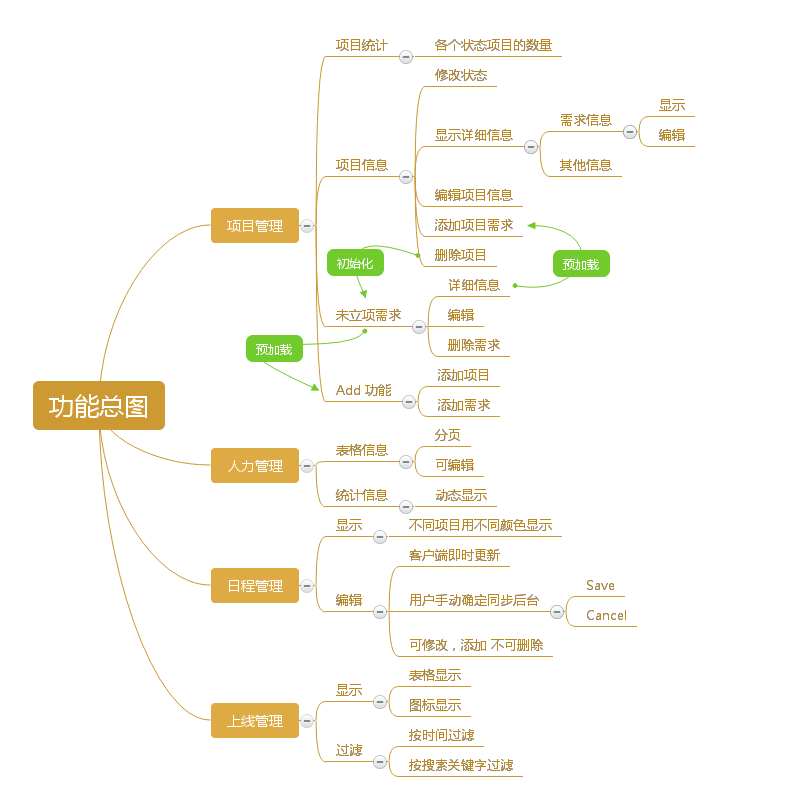

## 第一节 引言

### 1.1 编写目的

本文档编写的目的是为了记录,整理公司对项目系统的业务流程和功能需求， 描述用户对系统的需求和期望， 方便开发人员和用户进行业务交流以及为系统开发提供文档支持。 本文档尽量以自然语言来描述， 以期用户和潜在读者能够快速了解， 并方便与开发人员进行沟通

### 1.2 文档范围

本文档主要适用于项目所涉及公司相关部门的负责人员, 项目开发人员，对本项目开发提供指导支持的人员以及对本项目感兴趣的所有人员。

### 1.3 项目概要

项目名称： 新蛋公司PMS项目管理系统

任务提出者：新蛋公司MIS部门WWW项目部

开发者：上海大学夏季短实习项目组

用户：新蛋公司各个部门
### 1.4 术语和缩写

PMS：PMS项目管理系统

## 第二节 任务概述

### 2.1 目标

Project Management 项目是新蛋公司开发部门为提高项目管理效率而启动的一个开发项目.
由于历史原因, 到目前为止开发部门对项目的管理方式还是老式的共享文件方式。

所有开发经理共同维护一张Excel表格, 每天对表格更新后将表格Email给各个部门,这样的方式效率极其低下, 一定程度上影响了开发的效率以及增加了沟通的成本。

本项目旨在将公司项目管理的方式改成WEB版本, 所有部门人员可以根据自己的权限和需求了解或者编辑相关信息, 一些特色模块, 使得不同的人员可以更好的沟通，减轻开发之外的工作量, 提高开发效率

本系统与公司人员管理系统对接， 关系如下：

由于时间，权限等方面原因，本阶段项目自定义人员表， 做成完全内含系统，结构如下：
 
### 2.2 用户的特点

本系统最终用户为新蛋公司各个员工尤其是各部门负责人。具有非常熟练的WEB使用技术，同时对公司项目内容以及项目流程十分熟悉。不会有太多使用方面的困扰但对项目的使用效率有极高要求。

预计本系统每日访问数为30~50次。

### 2.3 假定和约束

开发期限：1个月

开发人员：上海大学夏季生产实习生

运行环境：Chrome、Firefox、IE9以上

网络要求：联网

系统要求：PC系统

人员要求：注册用户且具有相关权限

## 第三节 系统运行环境

### 3.1 系统架构

本系统采用WEB系统方式， 采用ASP.NET MVC开发框架，并在框架基础上扩展数据接口层，使得系统有更好的课扩展性， 系统的框架信息如下：
 
### 3.2 系统硬件和网络环境

硬件要求：PC平台

系统要求：WindowsXP以上，Linux，MacOS

网络要求：联网

对接要求：无

### 3.3 系统运行平台

最低要求：winXP+IE9

最佳要求：Win10+Chrome

### 3.4 系统界面描述

 
## 第四节 功能描述

### 4.1 对功能的规定

#### 系统名称: Project

设计人:王舒 杨永华

模块名: 显示项目信息

输入:鼠标点击

输出:项目信息/需求信息

处理: 从数据库中筛选当前项目, 分类,格式化后以列表的形式展示 |

注释:将最重要的信息展示在第一页 |

#### 系统名称: Project

设计人: 王舒 杨永华

模块名: 编辑项目/需求 

输入: 修改后的需求

输出: 修改后的页面

处理: 将信息写入数据库, 重新执行显示信息模块

注释: 修改后数据的重要性有可能发生变化

#### 系统名称: Project

设计人: 杨永华

模块名: 确定项目LO 

输入: 项目信息

输出: 跟新后的项目列表, 包括lo信息

处理: 根据Luanchdate和项目优先级给项目设置LO, 每一次更改将重新排序

注释:可认为设置lo

#### 系统名称: WorkPercentage

设计人: 宋建鑫

模块名: Show 

输入: 鼠标

输出: 直观显示工作量信息(图表)

处理: 从数据库筛选当前在职人员工作量数据, 通过可视化手段输出

注释: 同时保留Edit功能

#### 系统名称: WorkPercentage

设计人:宋建鑫

模块名:  Edit 

输入: 键盘输入更新到数据

输出: 跟新后的页面

处理: 合法数据写入数据库, 重新执行Show模块

####系统名称: WorkHours

设计人: 方朝增

模块名: Show 

输入: 鼠标

输出: WorkHours表

处理: 读取数据, 排序, 分组, 筛选重要信息, 格式化, 可视化输出

注释: 实现NextWeek功能, 保留Edit/Add功能

系统名称: WorkHours

设计人: 方朝增

模块名: PreWeek/NextWeek 

输入: 鼠标单击 输出: 当前时区往前/往后一周的WorkHOurs信息

处理:以preweek为例, 获取前一周数据, 构造n\*1数组, 删除最后一周数据, 在最新一周前添加一列显示 

注释: 保证表格数据为8周

#### 系统名称: WorkHours 设计人: 方朝增

模块名:  Edit 

输入: 键盘

输出: 更新后的数据

处理: 用户直接在表格更改信息, 根据选项做相应内容: 

1. SaveUpdates: 更新数据并将数据同步到数据库,渲染新的表格
2. Cancel: 放弃更新并重新渲染原始表格
3. AddNeewWeek:添加空白周以供用户编辑

注释: 所有信息交互需要格式化过滤

#### 系统名称: Launched

设计人: 雷薇

模块名:  show 

输入: 鼠标

输出: 原始的WorkHours信息

处理: 读取数据, 渲染成表格

#### 系统名称: Launched

设计人: 雷薇

模块名: Filter 

输入: 过滤

输出: 过滤后的表格

处理: 根据过滤条件筛选信息后重新渲染表格

注释:过滤包括按条件过滤和按关键词搜索过滤

#### 系统名称: DailyReport

设计人: 宋建鑫

模块名: Download 

输入: 鼠标

输出: Excel表格

处理: 将各个模块信息以电子表格的形式下载到用户客户端

#### 系统名称: PMS

设计人: 雷薇

模块名: UI 

输入: 无

输出: 系统UI

 
### 4.2 功能性需求描述

####4.2.1 功能总图
 

 
####4.2.1 功能描述

##### 项目管理

- 项目统计
- 项目信息
- 编辑项目
- 未立项需求
- 添加项目、需求

##### 人力管理

- 表格显示、编辑
- 图标显示
- 日程管理 查看其他时间安排
- 表格显示、编辑、添加

##### 上线管理

- 显示
- 过滤

### 4.3 对非功能的描述

####4.3.1 系统参数及系统精度

系统所有信息将从数据库读取, 所有信息需要验证合法性以及格式化后方能写入数据库。

####4.3.2 灵活性

- 使用响应式布局, 大部分页面可以很好的适应不同的显示设备
- 使用跨平台特性样式, 可以适应不同的浏览器版本(IE6以上)
- 使用Web形式, 不限系统, 不限地点访问

#### 4.3.3  输入输出要求

| 项目 |项目 | 数据类型 | 约束 |
| -- | -- | -- | -- |
| Project | LO | 整数 | >0 |
| Project | 一般信息 | 文本 |  |
| Project | 日期类信息 | 日期 |  |
| Project | 工时类信息 | 浮点数 | 精度：0.1 |
| Project | 标识类信息 | 文本 | 符合标识约束 |
| WorkPercentage | WorkPercent | 整数 | 0~120 |
| WorkPercentage | WorkLoadPercent | 整数 | 0~120 |
| WorkPercentage | 其他 | 文本 |  |
| WorkHours | 所有 | 文本 |  |

